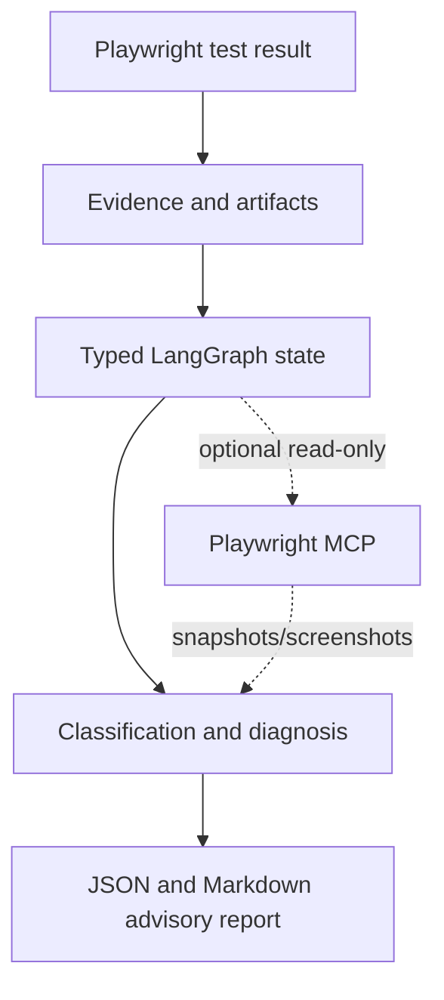

# VA.gov Playwright Test Automation Platform

An independent, production-oriented TypeScript and Playwright framework for safe, publicly observable VA.gov behavior. It demonstrates test automation architecture, API testing, network control, containerized execution, CI/CD quality gates, and defense-in-depth security practices.

> This project is not affiliated with VA.gov, the U.S. Department of Veterans Affairs, the U.S. Government, Google, or AWS. It is a portfolio project and must only be used against public functionality or explicitly authorized test environments.

## Contents

- [Goals and scope](#goals-and-scope)
- [Technology](#technology)
- [Repository structure](#repository-structure)
- [Quick start](#quick-start)
- [Configuration](#configuration)
- [Running tests](#running-tests)
- [Fixtures and test architecture](#fixtures-and-test-architecture)
- [Docker](#docker)
- [CI/CD](#cicd)
- [Security](#security)
- [Reports and diagnostics](#reports-and-diagnostics)
- [Test strategy](TEST_STRATEGY.md)
- [Troubleshooting](#troubleshooting)
- [Contributing](#contributing)
- [Roadmap](#roadmap)

## Goals and scope

The framework is designed around the following engineering goals:

- deterministic, isolated, parallel-safe tests;
- fast developer feedback through static checks and unit tests;
- environment-driven configuration with no committed secrets;
- semantic Playwright locators and web-first assertions;
- safe, read-only public-service checks;
- reproducible npm and Docker installs;
- actionable failure diagnostics;
- CI quality gates that run on every push and pull request;
- an optional integration boundary for future LangGraph, Deep Agents, or MCP tooling.

The current suite is a meaningful representative baseline. It intentionally does not generate duplicate tests merely to claim a target count. The planned expansion toward approximately 200 scenarios is documented in `TEST_STRATEGY.md` and `TEST_PLAN.md`.

The included tests do **not** submit claims, modify user accounts, delete resources, bypass authorization, or perform destructive operations against production.

## Technology

| Area                   | Technology                                                 | Purpose                                                |
| ---------------------- | ---------------------------------------------------------- | ------------------------------------------------------ |
| Language               | TypeScript, strict mode                                    | Typed test code and framework APIs                     |
| Browser/API automation | Playwright Test 1.63                                       | UI, APIRequestContext, routing, traces, and reports    |
| Unit tests             | Vitest                                                     | Fast tests for pure configuration and validation logic |
| Quality                | ESLint, Prettier                                           | Static analysis and consistent formatting              |
| Local hooks            | Husky, lint-staged                                         | Fast staged-file checks before commits                 |
| CI/CD                  | GitHub Actions                                             | Quality gates, browser matrix, sharding, and artifacts |
| Container              | Docker, Compose                                            | Reproducible non-root Playwright execution             |
| Security               | CodeQL, npm audit, Trivy, optional Snyk, Dependency Review | SAST, SCA, image scanning, and dependency review       |
| Dependency updates     | Dependabot                                                 | npm, GitHub Actions, and Docker update proposals       |

LangGraph, LangChain, Deep Agents, and MCP are not runtime dependencies. The deterministic framework remains fully functional if AI services are unavailable.

The optional TypeScript failure-investigation layer is scaffolded under `agentic/investigator/`. It uses typed LangGraph state, an injectable analysis model, an optional Playwright MCP client, and OpenTelemetry spans. It is advisory only and is not invoked by `npm test`.

## Repository structure

```text
.
├── .github/
│   ├── dependabot.yml
│   └── workflows/
│       ├── playwright.yml          # quality, browser shards, Docker smoke test
│       ├── codeql.yml              # TypeScript CodeQL analysis
│       ├── security.yml            # Trivy and optional Snyk
│       ├── dependency-review.yml   # pull-request dependency review
│       └── zap.yml                 # manual authorized localhost baseline scan
├── .husky/                         # lightweight local hooks
├── agentic/                        # deterministic future-agent guardrails
├── api/clients/                    # typed API clients
├── config/                         # centralized environment parsing
├── data/                           # typed, non-secret datasets
├── fixtures/                       # Playwright test and API fixtures
├── pages/                          # focused page objects
├── tests/
│   ├── ui/                         # user-facing browser behavior
│   ├── api/                        # safe HTTP contract checks
│   └── network/                    # request/response and routing behavior
├── types/                          # shared TypeScript types
├── unit/                           # pure unit tests
├── utils/                          # reusable validation helpers
├── Dockerfile
├── compose.yaml
├── playwright.config.ts
├── package.json
└── package-lock.json
```

More detailed design decisions are documented in `ARCHITECTURE.md`, `TEST_STRATEGY.md`, `CI_CD.md`, `SECURITY.md`, and `TEST_PLAN.md`.

## Quick start

### Prerequisites

- Node.js `22.14.0` or a compatible Node 22 release
- npm
- Git
- Docker Desktop if running container or Compose tests

### Install locally

```text
npm ci
npm run install:browsers
```

The included public checks do not require credentials. To override defaults, copy `.env.example` to an uncommitted `.env` file and edit only safe environment values.

### Run the fast local gate

```text
npm run format:check
npm run lint
npm run typecheck
npm run test:unit
```

### Run the Chromium smoke suite

```text
HEADLESS=true npm test -- --project=chromium
```

### Run the complete browser matrix

```text
HEADLESS=true npm test
```

## Configuration

Configuration is parsed centrally in `config/environment.ts`. Tests should not read environment variables directly.

| Variable       | Default                             | Description                                               |
| -------------- | ----------------------------------- | --------------------------------------------------------- |
| `BASE_URL`     | `https://www.va.gov`                | Browser base URL                                          |
| `API_BASE_URL` | `BASE_URL`                          | API request-context base URL                              |
| `ENVIRONMENT`  | `local`, or `ci` when `CI=true`     | `local`, `ci`, `test`, or `staging`                       |
| `CI`           | `false`                             | Enables CI behavior such as retries and headless defaults |
| `HEADLESS`     | `CI` value                          | Browser headless mode                                     |
| `WORKERS`      | Playwright default locally, 2 in CI | Maximum Playwright workers                                |
| `RETRIES`      | `0` locally, `2` in CI              | Retry count for failed tests                              |
| `TIMEOUT`      | `30000`                             | Per-test timeout in milliseconds                          |
| `SHARD_INDEX`  | unset                               | One-based shard number; must be paired with `SHARD_TOTAL` |
| `SHARD_TOTAL`  | unset                               | Total shard count                                         |

Invalid URLs, booleans, integers, environments, and shard combinations fail closed during configuration loading.

## Running tests

| Command                                   | Purpose                                |
| ----------------------------------------- | -------------------------------------- |
| `npm test`                                | Run all Playwright projects            |
| `npm run test:ui`                         | Run UI tests                           |
| `npm run test:api`                        | Run API tests                          |
| `npm run test:network`                    | Run network tests                      |
| `npm run test:unit`                       | Run Vitest unit tests                  |
| `npm run typecheck`                       | Run strict TypeScript compilation      |
| `npm run lint`                            | Run ESLint                             |
| `npm run format:check`                    | Verify Prettier formatting             |
| `npm run ci:local`                        | Run the complete local quality gate    |
| `npm run test:agent`                      | Run investigator graph/config tests    |
| `npm run agent:config -- validate-config` | Validate optional agent configuration  |
| `npm run format`                          | Format supported repository files      |
| `npm run report`                          | Open the latest Playwright HTML report |

Run one browser project with Playwright's project option:

```text
npm test -- --project=firefox
npm test -- --project=webkit
```

Run a local shard with environment-driven configuration:

```text
SHARD_INDEX=1 SHARD_TOTAL=2 HEADLESS=true npm test -- --project=chromium
```

## Fixtures and test architecture

### Homepage fixture

Tests import the project test object from `fixtures/test.ts` instead of importing the raw Playwright object:

```typescript
import { expect, test } from '../../fixtures/test';

test('homepage is available', async ({ homePage }) => {
  await expect(homePage.page).toHaveTitle(/VA|Veterans Affairs/i);
});
```

Requesting `homePage` automatically navigates the isolated Playwright page to `/` using the configured `BASE_URL`. The fixture validates the response status and returns the focused `HomePage` object. Tests must not duplicate homepage navigation in `beforeEach` hooks.

### API fixture

API tests use `apiTest` from `fixtures/api.ts`. It creates an isolated `APIRequestContext` using `API_BASE_URL`, exposes the typed `PublicSiteClient`, and disposes the context during teardown.

### Isolation and mocking

Each Playwright test receives its own context. Network routes are scoped to individual tests; API and UI tests do not share mutable state. Real public read-only behavior is preferred for confidence. `route.fulfill`, `route.continue`, and `route.abort` are used for deterministic failure simulation, unavailable dependencies, and safe request/response validation—not indiscriminately across the suite.

## Optional agentic investigation layer

The first agentic milestone investigates failed Playwright evidence; it does not execute normal tests, change source code, push Git branches, or turn a failed test into a pass.



The graph defaults to deterministic classification and can run without an LLM. Local model integration is configured with Ollama and a Llama model. A future vLLM deployment can use the same provider boundary through an OpenAI-compatible endpoint. MCP is opt-in through `PLAYWRIGHT_MCP_COMMAND` and `PLAYWRIGHT_MCP_ARGS`; credentials and endpoints are never hard-coded.

Run the current agent checks with `npm run test:agent`. Validate configuration with `npm run agent:config -- validate-config` after copying `.env.example`. Real Ollama and Playwright MCP execution requires an explicitly authorized local/test environment and is not part of the standard CI or Playwright test command.

## Docker

Docker is a first-class execution path, not an optional convenience. The multi-stage `Dockerfile`:

- installs dependencies with `npm ci` from `package-lock.json`;
- uses a Playwright-compatible browser image;
- copies only required application and test directories;
- excludes secrets, reports, and development metadata through `.dockerignore`;
- creates writable report directories;
- runs as the non-root `pwuser` account;
- returns the Playwright exit code.

### Build and run

```text
docker build --tag va-automation:test .
docker run --rm --env CI=true --env HEADLESS=true va-automation:test
```

### Compose

Use Compose for a repeatable local Chromium run:

```text
docker compose build
docker compose run --rm tests
docker compose down
```

Compose supports environment overrides, for example `WORKERS=1 docker compose run --rm tests`. Do not pass secrets through image build arguments or commit them to Compose files.

## CI/CD

The primary workflow, `.github/workflows/playwright.yml`, runs on every push and pull request and uses least-privilege repository permissions.

### Quality job

The quality gate runs first and fails fast on:

1. `npm ci`
2. Prettier validation
3. ESLint
4. strict TypeScript compilation
5. Vitest unit tests
6. `npm audit --audit-level=high`

### Browser jobs

After the quality gate, a matrix runs Chromium, Firefox, and WebKit across two Playwright shards. The shard count is intentionally bounded to balance feedback speed, runner capacity, and public-service rate limits. Increase it only after measuring duration and reliability.

Each browser job uploads HTML reports, JUnit results, traces, screenshots, videos, and other `test-results` files when available.

### Container job

The workflow builds the Docker image and runs a Chromium smoke suite inside the container. This verifies that local, container, and CI execution use the same test implementation.

### Workflow reliability

The pipeline uses:

- dependency caching through `actions/setup-node`;
- concurrency cancellation for obsolete branch runs;
- matrix parallelism with `fail-fast: false`;
- explicit job dependencies;
- artifact retention;
- configurable Playwright workers and retries.

## Security

Security controls are layered rather than delegated to one tool:

- **CodeQL:** JavaScript/TypeScript static analysis on GitHub-hosted runners.
- **npm audit:** dependency vulnerability signal in the quality job.
- **Dependabot:** scheduled npm, GitHub Actions, and Docker update proposals.
- **Dependency Review:** pull-request review of newly introduced dependencies.
- **Trivy:** CRITICAL and HIGH image vulnerability gate, ignoring unfixed issues.
- **Snyk:** optional dependency scan when the repository enables `SNYK_ENABLED=true` and configures `SNYK_TOKEN` as a GitHub secret.
- **OWASP ZAP:** manual baseline workflow restricted to explicitly provided localhost targets.
- **Husky/lint-staged:** fast staged-file formatting and linting before commits.

Enable GitHub secret scanning with push protection, branch protection, Dependabot security updates, and required status checks in repository settings before publishing.

Never commit `.env`, credentials, API keys, tokens, auth state, private keys, or PII. The agent guardrail module in `agentic/guardrails.ts` provides explicit command/host allowlists and fail-closed risk decisions for future adapters. It does not grant unrestricted shell, filesystem, Docker, GitHub, or network access.

## Reports and diagnostics

Playwright is configured to produce:

- HTML report in `playwright-report/`;
- JUnit XML in `test-results/playwright-junit.xml`;
- traces retained on failure;
- screenshots on failure;
- videos retained on failure;
- unit-test JUnit XML in `test-results/unit-junit.xml`.

Open the HTML report with:

```text
npm run report
```

Review the first failing assertion, test URL, browser project, retry, trace, screenshot, and network evidence before changing a selector or increasing a timeout.

## Troubleshooting

### Browser launch fails locally

Install the pinned Playwright browsers:

```text
npm run install:browsers
```

### Configuration validation fails

Check `BASE_URL`, `API_BASE_URL`, `ENVIRONMENT`, boolean values, positive integers, and paired shard variables. Start from `.env.example` and avoid trailing or relative URLs.

### Tests are slow or rate-limited

Use Chromium for fast feedback, reduce `WORKERS`, and avoid increasing CI shards without measuring service impact. Public endpoints may apply rate limits or bot protections.

### Local `act` cannot run CodeQL

CodeQL depends on GitHub's security-events service. Local `act` also needs a valid token to pre-fetch and initialize the CodeQL action. Use GitHub-hosted Actions for authoritative CodeQL results; never commit or echo a token.

On Apple Silicon, local `act` may require an explicit Linux architecture such as `linux/amd64`.

### Docker reports permission errors

Use the provided Dockerfile and runtime directories. The image creates `test-results` and `playwright-report` and runs as `pwuser`; do not override the container user without a reason.

## Contributing

1. Create a branch from `main`.
2. Keep behavior safe, read-only, and appropriately scoped.
3. Add or update focused fixtures, data, tests, and documentation together.
4. Prefer semantic locators and web-first assertions.
5. Do not add arbitrary sleeps, shared mutable state, or destructive production requests.
6. Run the fast quality gate before committing.
7. Inspect the diff and generated artifacts before opening a pull request.

Husky runs `lint-staged` and then the complete deterministic local quality gate on every commit. The pre-push hook repeats that gate before code can be pushed. `npm run ci:local` runs formatting, ESLint, strict TypeScript, unit tests, npm audit, and the complete Playwright browser matrix. This is intentionally thorough and may take several minutes.

Every pull request is validated by GitHub Actions through `.github/workflows/playwright.yml`. Hosted-only controls—CodeQL, Trivy, Dependency Review, optional Snyk, and the authorized ZAP workflow—remain in GitHub Actions because they require hosted services, container capabilities, or repository security context that local Git hooks cannot faithfully provide.

## Roadmap

- Expand coverage by risk toward the documented approximately 200-scenario target.
- Add safe accessibility-oriented checks where they provide user value.
- Add approved non-production authentication workflows when test identities and secret handling are available.
- Add typed response schemas for stable, authorized API contracts.
- Add report aggregation for multi-shard CI runs.
- Expose deterministic execution/report interfaces to optional LangGraph or MCP adapters.
- Keep AI orchestration separate, permissioned, auditable, and nonessential to core test execution.

## License and disclaimer

Review the repository license before reuse. This project is an independent engineering portfolio and makes no claim of affiliation, endorsement, authorization, or access to internal VA systems.
